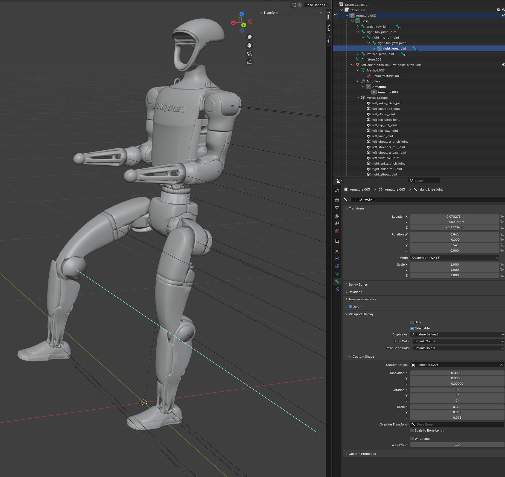

# G1 Blender Arms Exporter

This project exports a rigged GLB file from a MuJoCo MJCF file. The resulting GLB file contains an armature where meshes are parented to bones, suitable for use in 3D software like Blender.



Note that there is alot of unused code here experimenting with mujoco and blender - just disregard (or alternatively, explore it!)

## Installation

This project uses `uv` for package management.

1.  Create and activate a virtual environment:
    ```bash
    python -m venv .venv
    source .venv/bin/activate
    ```

2.  Install the required packages using `uv`:
    ```bash
    uv pip install pygltflib trimesh numpy scipy
    ```

Sorry I didn't get a proper requirements.txt or .toml going.

## Usage

To generate the rigged `robot_rigged_g1_full.glb` file in the `output/` directory, run the main export script:

```bash
python main_export.py
```
